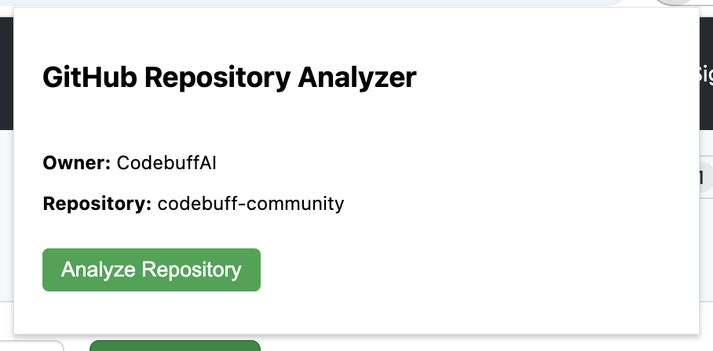
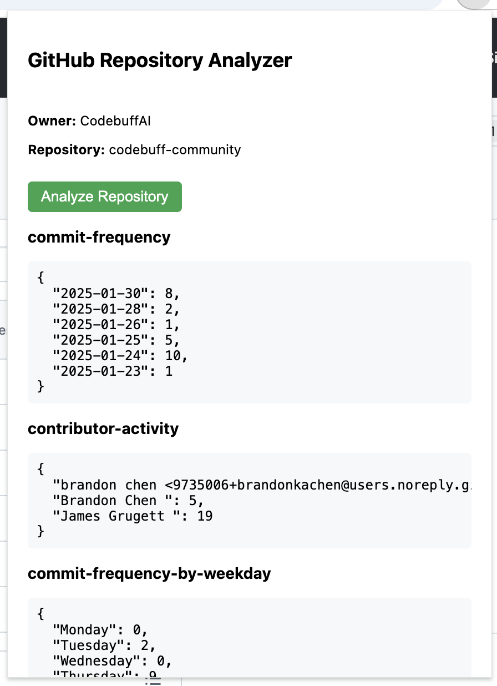

# GitHub Repository Analyzer

A Chrome extension that analyzes GitHub repositories for development patterns and metrics!

<p align="center">
  
  
</p>


## Features
- Commit frequency analysis
- Contributor activity tracking
- Commit patterns by weekday
- Average commit size metrics

## Prerequisites
- Python 3.8 or higher
- Google Chrome browser
- Git

## Setup Instructions

### 1. Clone the Repository
```bash
git clone <your-repo-url>
cd code-analysis
```

### 2. Set Up Python Environment
```bash
# Create and activate virtual environment
python -m venv .venv
source .venv/bin/activate  # On Windows use: .venv\Scripts\activate

# Install dependencies
pip install -e .

# Install development dependencies (optional)
pip install -e ".[dev]"
```

### 3. Start the Backend Server
```bash
# Start the FastAPI server
./start_server.sh
```
The server will run at http://localhost:8000

### 4. Install Chrome Extension
1. Open Chrome and navigate to `chrome://extensions/`
2. Enable "Developer mode" in the top right
3. Click "Load unpacked"
4. Select the `extension` directory from this project

### 5. Using the Extension
1. Navigate to any GitHub repository
2. Click the extension icon in Chrome's toolbar
3. Click "Analyze Repository" to see metrics

## Development

### Running Type Checks
```bash
mypy cli app
```

### Format Code
```bash
black cli app
```

### API Documentation
When the server is running, visit:
- http://localhost:8000/docs for interactive API documentation
- http://localhost:8000/redoc for alternative documentation view

## Troubleshooting

### Common Issues
1. If the extension shows "No repository detected":
   - Refresh the GitHub page
   - Make sure you're on a repository page

2. If analysis fails:
   - Check that the backend server is running
   - Look for errors in the server logs

3. If the extension doesn't load:
   - Check Chrome's extension page for errors
   - Try reloading the extension

### Server Logs
The FastAPI server logs all operations. Check the terminal where you ran `start_server.sh` for detailed error messages.

## Architecture
- `cli/`: Command-line interface for git analysis
- `app/`: FastAPI web service
- `extension/`: Chrome extension files
